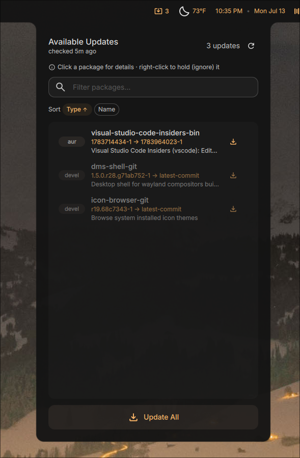
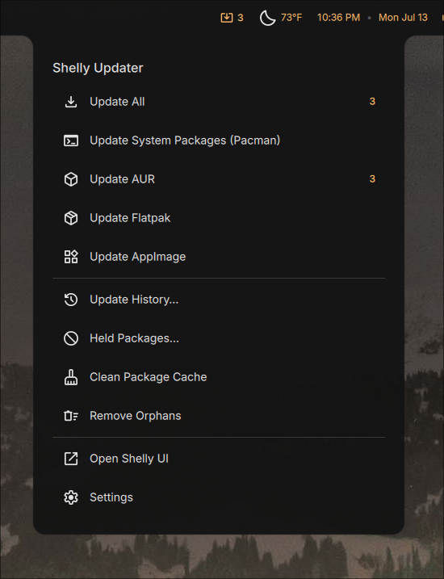
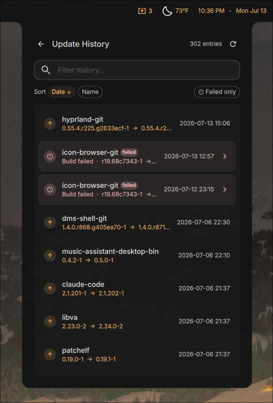
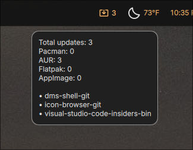

# Shelly Updater

## Type: DankBar Widget

A comprehensive system-update widget for [DankMaterialShell](https://github.com/AvengeMedia/DankMaterialShell)
backed by the [Shelly (ALPM)](https://github.com/Seafoam-Labs/Shelly-ALPM) CLI.

It unifies **pacman**, **AUR**, **Flatpak** and **AppImage** updates into a single
DankBar pill with a detailed updates view and an action menu.

## Screenshots

| Updates view | Action menu |
|:---:|:---:|
|  |  |
| **Update history** | **Hover tooltip** |
|  |  |

## Features

- One pill for all update sources (pacman always on; AUR / Flatpak / AppImage toggleable),
  with an option to exclude devel / `-git` AUR packages
- Configurable automatic checks (15 min, 30 min, 1 hr, 4 hr, once a day) and check-at-startup
- **Updates view** (default left click) — every pending update grouped with descriptions and
  download size, an **Update All** button, and a per-item update button
  - **Text filter** to search by name / description / version / source
  - **Sort** by type (pacman → aur → devel → flatpak → appimage) or name
  - Click a package for an extended **detail view** (info, clickable URL, hold/unhold,
    downgrade, update-this-package); right-click a pacman/AUR row to **hold** (ignore) it
- **Menu** (default right click) — Update All, Update System (Pacman), Update AUR / Flatpak /
  AppImage (hidden when disabled), **Held Packages**, **Update History**, Open Shelly UI, and Settings
- **Update History** — successful upgrades/downgrades (from `/var/log/pacman.log`) merged with
  the plugin's own failed-update log; text filter, sort by date or name, and a **failed-only** toggle
- **Failed-update detection** — after an upgrade, packages that didn't apply are flagged in red with
  a **View log** button; failures are saved to history (with a captured log excerpt and configurable
  retention) and clickable for detail
- Optional desktop **notifications** when a background check finds new updates (with a minimum-count threshold)
- **Performance** — optionally run updates at lower CPU/IO priority (`nice`/`ionice`) and cap parallel
  build jobs, so large AUR builds don't peg the machine
- Configurable left / middle / right click actions
- Custom icons for the up-to-date and updates-available states
- Optional update count text with configurable position (horizontal: left/right, vertical: top/bottom)
- Optional hover tooltip with per-source counts and (optionally) package names
- Runs updates in your preferred terminal (defaults to `$TERMINAL`), with an option to close it when done
- Confirmation prompts toggle (off ⇒ `--no-confirm`), plus an always-confirm-kernel-updates option
- Multi-monitor aware — checks and the "updating" state stay in sync across every bar instance

## Prerequisites

Install the Shelly CLI:

```sh
sudo pacman -S shelly        # official repo
# or
yay -S shelly                # AUR helper
```

The GUI entry (`Open Shelly UI`) launches `shelly-ui`, which ships with the same package.

### Running updates without password prompts (optional)

Applying updates needs root. To skip the terminal password prompt, add a passwordless
sudoers rule for Shelly (review carefully — this grants passwordless root package management):

```sh
echo "$USER ALL=(root) NOPASSWD: /usr/bin/shelly" | sudo tee /etc/sudoers.d/shelly-nopasswd
sudo chmod 440 /etc/sudoers.d/shelly-nopasswd
```

Then run `shelly fix-permissions` once.

## How it queries Shelly

The widget shells out to Shelly's JSON mode:

| Source   | Check command                        | Apply command            |
|----------|--------------------------------------|--------------------------|
| pacman   | `shelly list-updates --json`         | `shelly upgrade`         |
| AUR      | `shelly aur list-updates --json`     | `shelly aur upgrade`     |
| Flatpak  | `shelly flatpak list-updates --json` | `shelly flatpak upgrade` |
| AppImage | `shelly appimage list-updates --json`| `shelly appimage upgrade`|
| All      | —                                    | `shelly upgrade-all`     |

Per-item updates use `shelly update <pkg>`, `shelly aur update <pkg>`, and
`shelly flatpak update <id>`. Holding uses `shelly ignore` and downgrades use
`shelly downgrade` / `shelly aur install-version`. Update History is read directly
from `/var/log/pacman.log` (Shelly has no history command), with failed updates
recorded by the plugin itself.

## Installation (development)

Symlink this directory into the DankMaterialShell plugins folder:

```sh
ln -s "$PWD" ~/.config/DankMaterialShell/plugins/shellyUpdater
```

Then enable **Shelly Updater** from DankMaterialShell → Settings → Plugins, and add the
widget to a DankBar section.

## License

MIT
