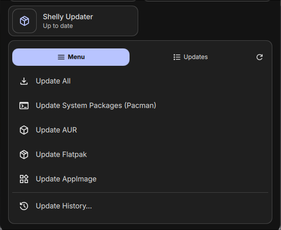
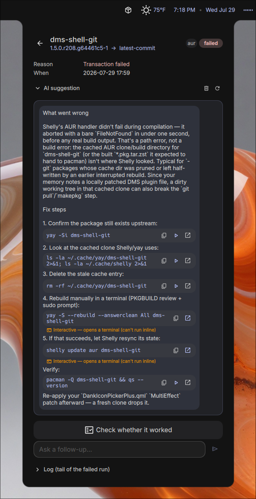

# Shelly Updater

## Type: DankBar Widget

A comprehensive system-update widget for [DankMaterialShell](https://github.com/AvengeMedia/DankMaterialShell)
backed by the [Shelly (ALPM)](https://github.com/Seafoam-Labs/Shelly-ALPM) CLI.

It unifies **pacman**, **AUR**, **Flatpak** and **AppImage** updates into a single
DankBar pill with a detailed updates view and an action menu.

> ⚠️ **Requires Shelly v3 or newer.** Shelly 3.0 reworked its command-line grammar
> (`shelly <verb> <type>` instead of `shelly <type> <verb>`), which **breaks plugin
> versions before 2.0.0**. If your updates suddenly stop appearing after a Shelly
> upgrade, update this plugin to **2.0.0+**. Conversely, 2.0.0 targets the v3 CLI and
> will not work on Shelly v2. The widget detects an unsupported Shelly and shows a
> clear "requires Shelly v3" banner instead of silently failing.

## Screenshots

| Updates view | Action menu |
|:---:|:---:|
|  |  |
| **Control-center panel** | **AI failure analysis** |
|  |  |
| **Update history** | **Hover tooltip** |
|  |  |

## Features

- One pill for all update sources (pacman always on; AUR / Flatpak / AppImage toggleable),
  with an option to exclude devel / `-git` AUR packages
- Configurable automatic checks (15 min, 30 min, 1 hr, 4 hr, once a day) and check-at-startup
- **Updates view** (default left click) — every pending update grouped with descriptions and
  download size, an **Update All** button, and a per-item update button
  - **Text filter** to search by name / description / version / source
  - **Sort** by type (pacman → aur → devel → flatpak → appimage) or name
  - Click a package for an extended **detail view** (info, clickable URL, hold/unhold,
    downgrade, update-this-package); right-click a pacman/AUR row to **hold** (ignore) it
- **Menu** (default right click) — Update All, Update System (Pacman), Update AUR / Flatpak /
  AppImage (hidden when disabled), **Held Packages**, **Update History**, Clean Package Cache, Remove Orphans,
  Open Shelly UI, **Reset** (clear a stuck refresh/upgrade state), and Settings
- **Update History** — successful upgrades/downgrades (from `/var/log/pacman.log`) merged with
  the plugin's own failed-update log; text filter, sort by date or name, and a **failed-only** toggle
- **Failed-update detection** — after an upgrade, packages that didn't apply are flagged in red and stay
  surfaced until actually resolved (updated, held, dismissed, or succeeded on a later run); each failure
  keeps a captured log excerpt and is clickable for detail. History retention is bounded by **age (days)
  or size (MB)**, whichever is hit first
- **AI failure analysis** (optional) — plug in your own AI CLI (e.g. `claude -p`, `opencode run`, `ollama`,
  `gemini`) to suggest a fix for a failure. Suggested shell commands get **copy** and **run-inline** buttons
  (with streamed output), and you can hold a short follow-up conversation. CLI-based by design — no API keys
  are stored, and subscription CLIs work without API credits. The prompt is fully user-editable
- **Interactive re-run** — when an update needs review (e.g. a changed AUR PKGBUILD that a non-interactive
  run silently skips), a button re-runs that package in a terminal that **stays open** so you can read the
  output and answer any prompts. Available in the failure detail and on each update row
- **Arch news banner** — surfaces unread [Arch Linux news](https://archlinux.org/news/) (manual-intervention
  notices, etc.) in the updates view *before* you upgrade, so breaking changes don't catch you out
- **Control-center widget** — a compound tile with an in-panel **Menu | Updates** view (plus drill-in to
  history and failure detail) for the DankMaterialShell control center
- Optional desktop **notifications** — when a background check finds new updates (minimum-count threshold),
  and when an upgrade leaves failures (with actions to view details or get an AI explanation)
- **Performance** — optionally run updates at lower CPU/IO priority (`nice`/`ionice`) and cap parallel
  build jobs, so large AUR builds don't peg the machine
- Configurable left / middle / right click actions
- Custom icons for the up-to-date and updates-available states
- Optional update count text with configurable position (horizontal: left/right, vertical: top/bottom)
- Optional hover tooltip with per-source counts and (optionally) package names
- Runs updates in your preferred terminal (defaults to `$TERMINAL`), with an option to close it when done
- Confirmation prompts toggle (off ⇒ `--no-confirm`), plus an always-confirm-kernel-updates option
- Multi-monitor aware — checks and the "updating" state stay in sync across every bar instance

## Prerequisites

Install the Shelly CLI (**v3 or newer** — see the requirement note above):

```sh
sudo pacman -S shelly        # official repo
# or
yay -S shelly                # AUR helper
```

The GUI entry (`Open Shelly UI`) launches `shelly-ui`, which ships with the same package.
If updates ever get wedged behind a stale package-database lock, clear it with
`shelly utility --repair-db`.

### Running updates without password prompts (optional)

Applying updates needs root. To skip the terminal password prompt, add a passwordless
sudoers rule for Shelly (review carefully — this grants passwordless root package management):

```sh
echo "$USER ALL=(root) NOPASSWD: /usr/bin/shelly" | sudo tee /etc/sudoers.d/shelly-nopasswd
sudo chmod 440 /etc/sudoers.d/shelly-nopasswd
```

Then run `shelly utility --fix-permissions` once.

## How it queries Shelly

The widget shells out to Shelly's JSON mode, using the **Shelly v3 grammar**
(`shelly <verb> <type>`):

| Source   | Check command                          | Apply command             |
|----------|----------------------------------------|---------------------------|
| pacman   | `shelly list-updates standard --json`  | `shelly upgrade standard` |
| AUR      | `shelly list-updates aur --json`       | `shelly upgrade aur`      |
| Flatpak  | `shelly list-updates flatpak --json`   | `shelly upgrade flatpak`  |
| AppImage | `shelly list-updates appimage --json`  | `shelly upgrade appimage` |
| All      | —                                      | `shelly upgrade all`      |

Per-item updates use `shelly update standard|aur|flatpak <pkg>` (an interactive
re-run drops `--no-confirm` so review prompts appear). Package detail comes from
`shelly search standard|aur <pkg> --json`, holding from `shelly mark ignore`,
downgrades from `shelly downgrade`, cache/orphan cleanup from
`shelly purify standard -c` / `-o`, and the pre-upgrade news banner from
`shelly news -a --json`. Update History is read directly from `/var/log/pacman.log`
(Shelly has no history command), with failed updates recorded by the plugin itself.

> **Upgrading from Shelly v2?** Everything above changed in Shelly 3.0 — older
> plugin versions call the v2 forms (`shelly aur list-updates`, `shelly upgrade-all`,
> `shelly ignore`, …) which no longer exist, so they silently show nothing. Plugin
> **2.0.0** is the release that targets the v3 grammar.

## Installation (development)

Symlink this directory into the DankMaterialShell plugins folder:

```sh
ln -s "$PWD" ~/.config/DankMaterialShell/plugins/shellyUpdater
```

Then enable **Shelly Updater** from DankMaterialShell → Settings → Plugins, and add the
widget to a DankBar section.

## License

MIT
