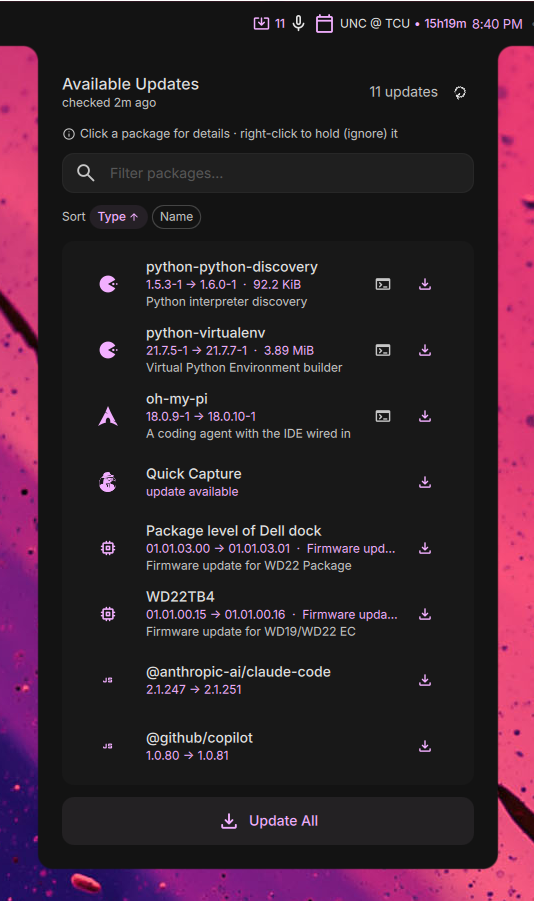
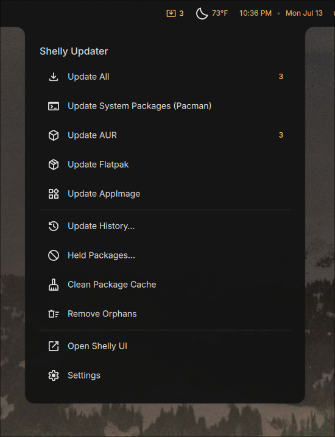
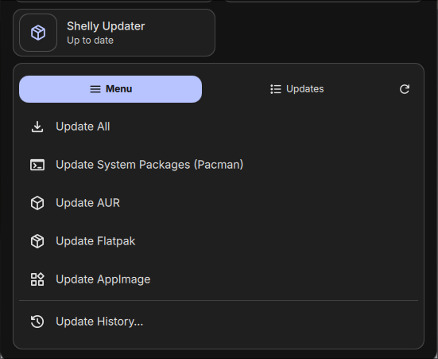
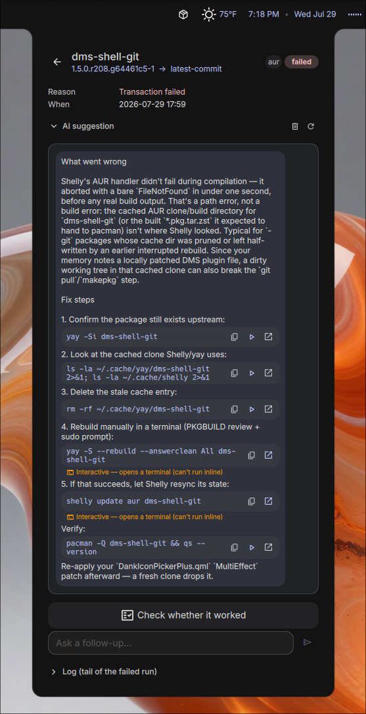
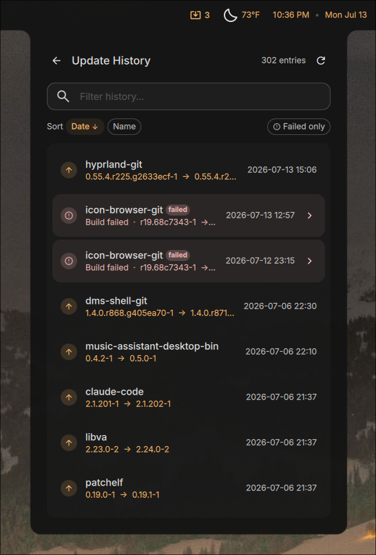
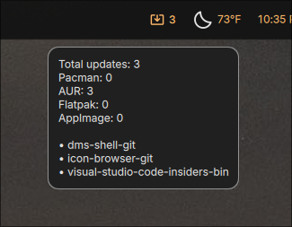

# Shelly Updater

## Type: DankBar Widget

A comprehensive system-update widget for [DankMaterialShell](https://github.com/AvengeMedia/DankMaterialShell)
backed by the [Shelly (ALPM)](https://github.com/Seafoam-Labs/Shelly-ALPM) CLI.

It unifies **pacman**, **AUR**, **Flatpak** and **AppImage** updates into a single
DankBar pill with a detailed updates view and an action menu — and optionally folds in
sources Shelly doesn't manage at all: **DMS plugins**, **device firmware**, **mise** tools
and **Rust toolchains**.

> ⚠️ **Requires Shelly v3 or newer.** Shelly 3.0 reworked its command-line grammar
> (`shelly <verb> <type>` instead of `shelly <type> <verb>`), which **breaks plugin
> versions before 2.0.0**. If your updates suddenly stop appearing after a Shelly
> upgrade, update this plugin to **2.0.0+**. Conversely, 2.0.0 targets the v3 CLI and
> will not work on Shelly v2. The widget detects an unsupported Shelly and shows a
> clear "requires Shelly v3" banner instead of silently failing.

## Screenshots

| Updates view | Action menu |
|:---:|:---:|
|  |  |
| **Control-center panel** | **AI failure analysis** |
|  |  |
| **Update history** | **Hover tooltip** |
|  |  |

## Features

- One pill for all update sources (pacman always on; AUR / Flatpak / AppImage toggleable),
  with an option to exclude devel / `-git` AUR packages
- **Beyond Shelly** — optional extra sources, each on by default and each auto-hidden when its
  command isn't installed, so the pill counts everything you actually need to update:
  - **DMS plugins** (`dms`) — updates to your installed DankMaterialShell plugins. Shelly Updater
    deliberately excludes *itself* here, since updating a plugin reloads it mid-run
  - **Device firmware** (`fwupdmgr`) — fwupd/LVFS updates. **Listing only**: firmware is never applied
    silently and is never swept up by *Update All*. Applying it always opens a terminal and runs
    `fwupdmgr`'s own prompts, because a bad flash is the one update here that can brick hardware
  - **mise tools** (`mise`) and **Rust toolchains** (`rustup`)
- Configurable automatic checks (15 min, 30 min, 1 hr, 4 hr, once a day) and check-at-startup
- **Updates view** (default left click) — every pending update grouped with descriptions and
  download size, an **Update All** button, and a per-item update button
  - **Text filter** to search by name / description / version / source
  - **Sort** by type (pacman → aur → devel → flatpak → appimage) or name
  - Click a package for an extended **detail view** (info, clickable URL, hold/unhold,
    downgrade, update-this-package); right-click a pacman/AUR row to **hold** (ignore) it
- **Menu** (default right click) — Update All, Update System (Pacman), Update AUR / Flatpak /
  AppImage (hidden when disabled), **Held Packages**, **Update History**, Clean Package Cache, Remove Orphans,
  Open Shelly UI, **Reset** (clear a stuck refresh/upgrade state), and Settings
- **Update History** — successful upgrades/downgrades (from `/var/log/pacman.log`) merged with
  the plugin's own failed-update log; text filter, sort by date or name, and a **failed-only** toggle
- **Failed-update detection** — after an upgrade, packages that didn't apply are flagged in red and stay
  surfaced until actually resolved (updated, held, dismissed, or succeeded on a later run); each failure
  keeps a captured log excerpt and is clickable for detail. History retention is bounded by **age (days)
  or size (MB)**, whichever is hit first
- **AI failure analysis** (optional) — plug in your own AI CLI (e.g. `claude -p`, `opencode run`, `ollama`,
  `gemini`) to suggest a fix for a failure. Suggested shell commands get **copy** and **run-inline** buttons
  (with streamed output), and you can hold a short follow-up conversation. CLI-based by design — no API keys
  are stored, and subscription CLIs work without API credits. The prompt is fully user-editable
- **Interactive re-run** — when an update needs review (e.g. a changed AUR PKGBUILD that a non-interactive
  run silently skips), a button re-runs that package in a terminal that **stays open** so you can read the
  output and answer any prompts. Available in the failure detail and on each update row
- **Arch news banner** — surfaces unread [Arch Linux news](https://archlinux.org/news/) (manual-intervention
  notices, etc.) in the updates view *before* you upgrade, so breaking changes don't catch you out
- **Control-center widget** — a compound tile with an in-panel **Menu | Updates** view (plus drill-in to
  history and failure detail) for the DankMaterialShell control center
- Optional desktop **notifications** — when a background check finds new updates (minimum-count threshold),
  and when an upgrade leaves failures (with actions to view details or get an AI explanation)
- **Performance** — optionally run updates at lower CPU/IO priority (`nice`/`ionice`) and cap parallel
  build jobs, so large AUR builds don't peg the machine
- Configurable left / middle / right click actions
- **Per-source logos** — each source is drawn with its own mark (Pac-Man-style disc for pacman,
  Arch for AUR, Flatpak, AppImage, Dank for DMS plugins, mise, Rust) in the menu and on each update
  row, bundled locally so the widget never fetches anything to draw itself. **Tint source logos with
  theme color** (on by default) maps each mark onto your accent so they move with your palette;
  turn it off for the original brand colors. Warning chips (`failed` / `kernel` / `devel`) always
  win over the logo, since a brand mark would bury them
- Custom icons for the up-to-date and updates-available states
- Optional update count text with configurable position (horizontal: left/right, vertical: top/bottom)
- Optional hover tooltip with per-source counts and (optionally) package names
- Runs updates in your preferred terminal (defaults to `$TERMINAL`), with an option to close it when done
- Confirmation prompts toggle (off ⇒ `--no-confirm`), plus an always-confirm-kernel-updates option
- Multi-monitor aware — checks and the "updating" state stay in sync across every bar instance

## Prerequisites

Install the Shelly CLI (**v3 or newer** — see the requirement note above):

```sh
sudo pacman -S shelly        # official repo
# or
yay -S shelly                # AUR helper
```

The GUI entry (`Open Shelly UI`) launches `shelly-ui`, which ships with the same package.
If updates ever get wedged behind a stale package-database lock, clear it with
`shelly utility --repair-db`.

### Running updates without password prompts (optional)

Applying updates needs root. To skip the terminal password prompt, add a passwordless
sudoers rule for Shelly (review carefully — this grants passwordless root package management):

```sh
echo "$USER ALL=(root) NOPASSWD: /usr/bin/shelly" | sudo tee /etc/sudoers.d/shelly-nopasswd
sudo chmod 440 /etc/sudoers.d/shelly-nopasswd
```

Then run `shelly utility --fix-permissions` once.

## How it queries Shelly

The widget shells out to Shelly's JSON mode, using the **Shelly v3 grammar**
(`shelly <verb> <type>`):

| Source   | Check command                          | Apply command             |
|----------|----------------------------------------|---------------------------|
| pacman   | `shelly list-updates standard --json`  | `shelly upgrade standard` |
| AUR      | `shelly list-updates aur --json`       | `shelly upgrade aur`      |
| Flatpak  | `shelly list-updates flatpak --json`   | `shelly upgrade flatpak`  |
| AppImage | `shelly list-updates appimage --json`  | `shelly upgrade appimage` |
| All      | —                                      | `shelly upgrade all`      |

Per-item updates use `shelly update standard|aur|flatpak <pkg>` (an interactive
re-run drops `--no-confirm` so review prompts appear). Package detail comes from
`shelly search standard|aur <pkg> --json`, holding from `shelly mark ignore`,
downgrades from `shelly downgrade`, cache/orphan cleanup from
`shelly purify standard -c` / `-o`, and the pre-upgrade news banner from
`shelly news -a --json`. Update History is read directly from `/var/log/pacman.log`
(Shelly has no history command), with failed updates recorded by the plugin itself.

> **Upgrading from Shelly v2?** Everything above changed in Shelly 3.0 — older
> plugin versions call the v2 forms (`shelly aur list-updates`, `shelly upgrade-all`,
> `shelly ignore`, …) which no longer exist, so they silently show nothing. Plugin
> **2.0.0** is the release that targets the v3 grammar.

## Sources beyond Shelly

The extra sources are **descriptors, not special cases** — one table entry defines a
source's command, parser, apply action and staleness window, so adding another is a
few lines rather than a new code path.

| Source      | Check command                        | Apply command                |
|-------------|--------------------------------------|------------------------------|
| DMS plugins | `dms plugins update --all --check`   | `dms plugins update --all`   |
| Firmware    | `fwupdmgr get-updates --json`        | `fwupdmgr update` *(manual)* |
| mise        | `mise outdated --json`               | `mise upgrade`               |
| rustup      | `rustup check`                       | `rustup update`              |

Two things make this safe to leave on:

- **Results are file-backed, not per-widget.** A bar widget exists once per monitor, and
  `dms plugins update --check` is a ~40 s network call — so a refresh runs *once* under a
  lock, writes each source's raw output under `~/.cache/shelly-updater/`, and every
  instance simply reads those files. Network sources re-run at most every 6 hours;
  firmware, which is a local daemon query, refreshes every cycle.
- **Failure detection and AI analysis stay Shelly-only.** Those parse pacman/makepkg build
  logs and would mis-read a firmware or plugin run, so external sources are excluded from
  them by design.

Each source disappears entirely when its command isn't installed, so an unused toggle
costs nothing.

### Logo assets

`assets/` holds one SVG per source. Marks drawn in plain ink (mise, Rust) ship as a
light/dark pair — the base file is inked dark for light backgrounds, the `-dark` file
inked light for dark ones — and are selected via `Theme.isLightMode`. Everything else is
a single brand-colored file that reads on either. `assets/pacman.svg` is original artwork
(a circle with a wedge removed, plus two pellets), not traced from any game asset.

Every mark is drawn in a **single color with its detail as negative space**, so tinting is a
straight color replacement (`ColorOverlay`) that keeps only the alpha. That matters: the
obvious alternative, `MultiEffect` colorization, shifts hue and saturation but *preserves
lightness*, which means pure-ink marks can't move at all (white stays white) and every other
mark comes out as dim as its own brand color happens to be — Arch and Flatpak have under half
the relative luminance of Pac-Man's yellow and rendered visibly darker than their neighbours.
With color replacement they all land on exactly the accent. Colorization remains as the
fallback for any future multi-tone asset added without `flat: true`.

`assets/appimage.svg` is redrawn for this reason: upstream it's a gradient-shaded plate with
the arrow and cog painted on top, which can't be flat-tinted. Here those are knocked out of
the plate instead (`fill-rule="evenodd"`), which both fixes the tinting and keeps the shapes
legible at 22px.

Dropping a source from the `sourceAssets` map in `ShellyUpdater.qml` makes it fall back to a
Material Symbol, which is also what firmware uses (no vendor mark suits it).

Logos are the trademarks of their respective projects and are used here only to identify
those projects.

## Installation (development)

Symlink this directory into the DankMaterialShell plugins folder:

```sh
ln -s "$PWD" ~/.config/DankMaterialShell/plugins/shellyUpdater
```

Then enable **Shelly Updater** from DankMaterialShell → Settings → Plugins, and add the
widget to a DankBar section.

## License

MIT
